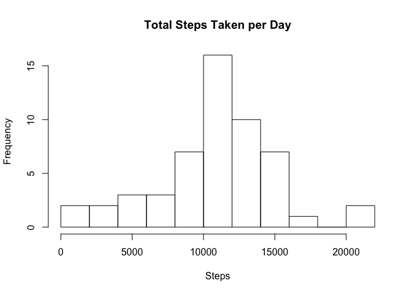
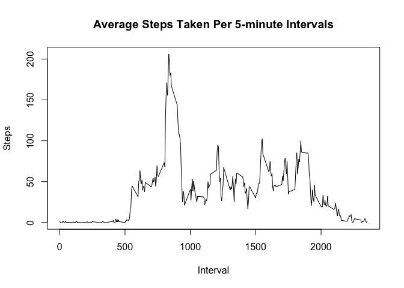
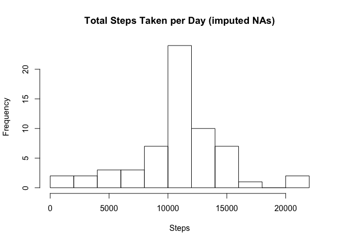
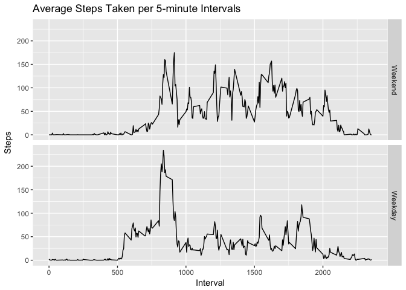

## Loading and preprocessing the data
First, I load all the necessary packages. 

```r
library(plyr)
library(dplyr)
```

```
## 
## Attaching package: 'dplyr'
```

```
## The following objects are masked from 'package:plyr':
## 
##     arrange, count, desc, failwith, id, mutate, rename, summarise,
##     summarize
```

```
## The following objects are masked from 'package:stats':
## 
##     filter, lag
```

```
## The following objects are masked from 'package:base':
## 
##     intersect, setdiff, setequal, union
```

```r
library(ggplot2)
```

Next, I unzip and download the data (in my working directory) that is used in this analysis. 

```r
if(!exists("activity")){
    unzip("activity.zip")
    activity <- read.csv("activity.csv")
}
```

Before moving on, I convert the date column into date objects so they will be 
easier to work with later. 

```r
activity$date <- as.Date(activity$date, format="%Y-%m-%d")
```

## What is mean total number of steps taken per day?
To answer this, I first aggregate the data to calculate sum of total steps taken 
each day. 

```r
dailySteps <- aggregate(steps ~ date, activity, sum)
```

I then am able to visualize this data using a histogram of the total number of
steps taken each day.

```r
hist(dailySteps$steps, breaks=10, xlab= "Steps", 
     main= "Total Steps Taken per Day")
```

<!-- -->

Finally, I calculate the mean and median of daily step totals. The summary function
calculates these two values. 

```r
summary(dailySteps$steps)
```

```
##    Min. 1st Qu.  Median    Mean 3rd Qu.    Max. 
##      41    8841   10765   10766   13294   21194
```

I then can display the mean and median individually.

```r
median <- summary(dailySteps$steps)[3]
mean <- summary(dailySteps$steps)[4]
mean
```

```
##     Mean 
## 10766.19
```

```r
median
```

```
## Median 
##  10765
```

## What is the average daily activity pattern?
Before I begin, I remove all the NA values and create a new "clean" dataframe.

```r
cleanActivity <- activity[!is.na(activity$steps), ]
```

Next, I take the average number of steps taken in a given interval across all days. 

```r
intervalAvg <- ddply(cleanActivity, .(interval), summarize, Avg = mean(steps))
```

Then I can plot these results in a time series plot over 5-minute intervals. 

```r
plot(intervalAvg, type="l", xlab="Interval", ylab="Steps", 
     main="Average Steps Taken Per 5-minute Intervals")
```

<!-- -->

Finally, by calculating the maximum number of steps taken during a given interval, 
I can match that to the interval that occured in and report the interval that contains the maximum amount of steps. I can then display that interval and the maximum number of steps. 

```r
maxSteps <- max(intervalAvg$Avg)
intervalAvg[intervalAvg$Avg==maxSteps,1]
```

```
## [1] 835
```

```r
maxSteps
```

```
## [1] 206.1698
```

## Imputing missing values
First, I want to know how many NA values there are in the "steps" column. 

```r
sum(is.na(activity$steps))
```

```
## [1] 2304
```
Next, I come up with a strategy to fill in these values. I am going to use the 
interval averages(averaged across all days) that I used earlier to fill in 
corresponding intervals with NA values.  

To do this, I first create a subset of the activity dataframe that contains
**only** the rows with NA values.

```r
na <- activity[is.na(activity$steps),]
```

Then, I merge the previously calculated interval averages with this dataframe 
by interval identifier. 

```r
mergedNA <- merge(intervalAvg, na, by.x="interval", by.y="interval", all=TRUE)
```

The columns must be re-arranged to match the original dataframe's format, then
I change the column names to correspond. 

```r
mergedNA <- mergedNA[,c(2,4,1)]
colnames(mergedNA) <- c("steps", "date", "interval")
```

Finally, I merge the NA dataframe with the clean dataframe I made earlier. 

```r
allActivity <- rbind(mergedNA, cleanActivity)
```


Now I can repeat my process from earlier, and make a new histogram of the daily
step averages using my newly imputed dataframe. Again, I aggregate and sum the data
by day, then make the histogram. 

```r
newDailySteps <- aggregate(steps ~ date, allActivity, sum)
hist(newDailySteps$steps, breaks=10, xlab= "Steps", 
     main= "Total Steps Taken per Day (imputed NAs)")
```

<!-- -->

Once again, I can also summarize the imputed data to see the mean and median.

```r
summary(newDailySteps$steps)
```

```
##    Min. 1st Qu.  Median    Mean 3rd Qu.    Max. 
##      41    9819   10766   10766   12811   21194
```

```r
median <- summary(newDailySteps$steps)[3]
mean <- summary(newDailySteps$steps)[4]
mean
```

```
##     Mean 
## 10766.19
```

```r
median
```

```
##   Median 
## 10766.19
```

The mean and median are now both 10766.19, when previously they were 10766 and 10765, respectively. This is pretty close, but with the imputed values the mean and median of the data are now equal to each other. 

## Are there differences in activity patterns between weekdays and weekends?
I need to create a new factor variable which identifies whether a day is a weekday or weekend.  

First, I create a column which gives the specific day of the week. 

```r
daysActivity <- mutate(activity, day=weekdays(date))
```

Next, I create a vector of strings that fall under "weekdays".

```r
weekday <- c("Monday","Tuesday", "Wednesday","Thursday","Friday")
```

From there I am able to create a new column, dayCat, that is a factor variable which shows if the day of the week falls under "weekend" or "weekday".

```r
daysActivity$dayCat <- factor((daysActivity$day %in% weekday), levels = c(FALSE,TRUE),labels=c("Weekend", "Weekday"))
```

Now I can move on to creating a plot. First, I must remove the NA values since I used the original dataset. 

```r
daysActivity <- daysActivity[!is.na(daysActivity$steps),]
```

Then I calculate the averages over a given interval across all days, split by weekday and weekend. 

```r
daysIntervalAvg <- ddply(daysActivity, .(interval, dayCat), summarize, Avg=mean(steps))
```

With this calculation I can create a panel plot to show the results. 

```r
g <- ggplot(daysIntervalAvg, aes(interval, Avg))
g+geom_line()+facet_grid(dayCat~.)+xlab("Interval")+ylab("Steps")+ggtitle("Average Steps Taken per 5-minute Intervals")
```

<!-- -->
